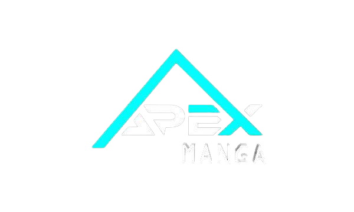
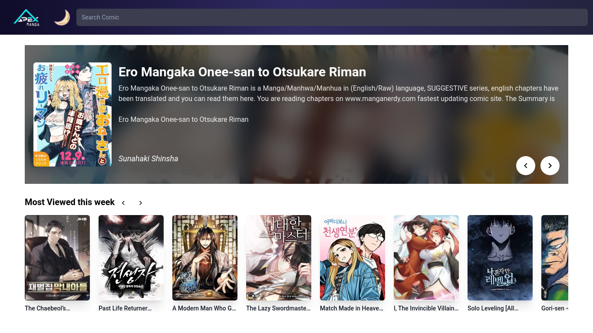
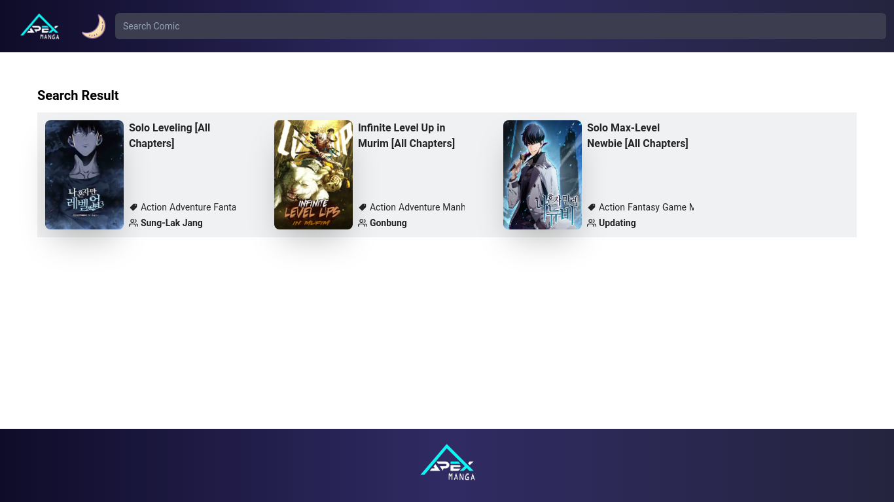

    
    <h1>
        <a href="https://manganerdy.com">Manganerdy</a>
    </h1>

Read Manga,Manwha,manhua online free, update fastest, most full, synthesized with high-quality images, with full English translation. all manga update daily.

<h2>Features</h2>
<h4>Home</h4>

<h4>Search Comics</h4>

<h4>Search Chapter</h4>

<h2>Local Development</h2>
These instructions should get you set up ready to work on Manganerdy 🙌

## Getting Started
1. Install `nvm` then `node` & `npm`: `brew install nvm && nvm install`
2. Install `watchman`: `brew install watchman`
3. Install dependencies: `npm install`

You can use any IDE or code editing tool for developing on any platform. Use your favorite!

## Environment variables 

### Client

### Server
